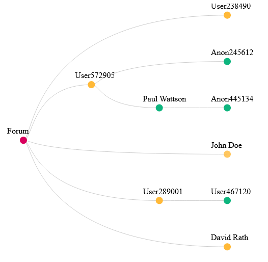

Nathan Vanson UNIGE

### _FR_ :

# Dynamiser les discussions sur Moodle par l'intermédiaire d'arborescence, mindmap.

### ID Project : 95

Réalisation de ce projet dans le cadre du cours d'**Applications Informatiques** en 2ème année de Bachelor en Science Informatiques à l'Université de Genève (UNIGE) ainsi que de l'évenement **P3**.

---

## Projet et Information :

Ce projet est une extension de Moodle, et qui a pour but d'**améliorer visuellement** les forums de discussions sur Moodle (UNIGE) afin de leur garantir une **meilleure visibilité** ainsi qu'une **meilleure facilité d'utilisation**. Cette visualisation sous forme de mindmap afin de trouver rapidement une réponse ou une question pertinente en fonction de l'activité du forum.

Le contenu proposé ici est complètable avec l'API Moodle. 
En effet, j'ai fourni un exemple de forum avec des informations récupéré par le JSON, car faute de temps, afin de finir le projet, il faut un compte admin Moodle pour pouvoir utiliser les API qu'il propose.

L'objectif était que : par l'intermédiaire de l'API Moodle, ce dernier va extraire les informations contenu dans le forum et les convertirs sous la forme d'un JSON pour effectuer la visualisation en mindmap qui sera ouvert sur une page html à chaque fois que l'on souhaite utilisé l'extension.

Il est donc important d'avoir au préalable un compte admin Moodle.

Outils Utilisés :

* **HTML**

* **JavaScript** 

* Framework JS **D3**

* **JSON**

---

## Comment tester le programme ? :

Afin de pouvoir tester le programme correctement, il faut suivre les étapes suivantes :

> 1. **Utiliser un serveur local host pour l'ouverture d'une page HTML, ou utiliser l'extension "Live Server" disponible sur VSCode. (skip l'étape 2 si vous ouvrez un serveur local HTML)**

> 2. **VSCode : cliquer sur "Go Live" pour lancer la visualisation sur la page HTML.**

> 3. **Vous pouvez également modifier les informations contenu dans le JSON si vous le souhaitez, afin que vous puissiez voir en direct les changements apportés, tant que cela reste dans le bon format.**

Voici un résultat attendu lors de l'utilisation du projet comme extension Moodle :

- Le **point rouge** correspond au **point central du forum** (c'est le lien contenant le forum Moodle en question).

- Les **points jaunes** correspondent aux questions posées via la thématique, avec le nom de l'utilisateur ayant posé la question ainsi que les différents noeuds vers les réponses.

- Les **points verts** correspondent quand à eux aux réponses aux questions posées, représentée également par un nom d'utilisateur. De même que les questions, on peut répondre à une répondre pour enchaîne et avoir un visualisation progressive des discussions.

---

## Annexes :

Liens utiles concernant le développement du projet :

- Framework **D3** : 

    * https://d3js.org/

    * https://github.com/d3/d3-selection

- Lien vers le prototype de lancement :

    * https://www.figma.com/file/GdxOfci1Dpw2x3XeAYWoyA/Prototype-UNIGE-Project?node-id=0%3A1

